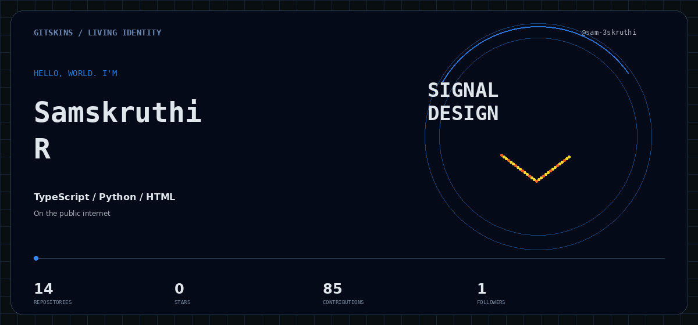
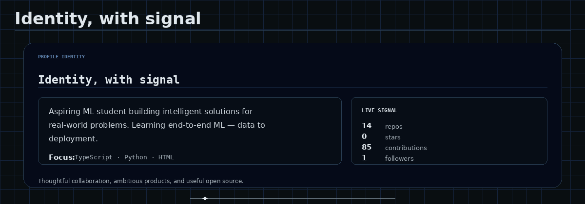
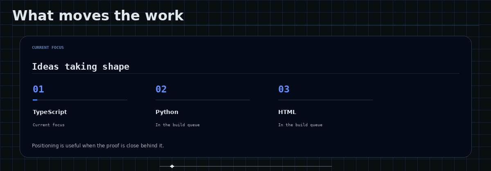
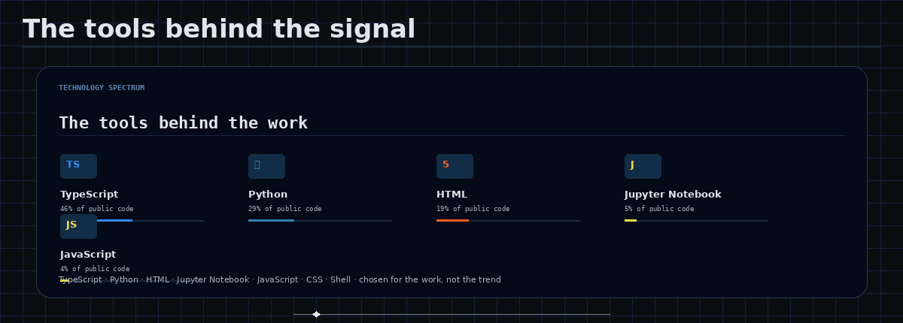
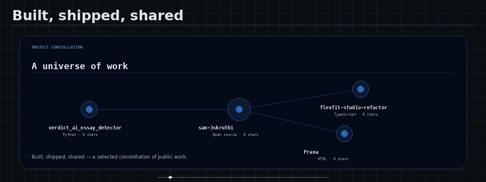
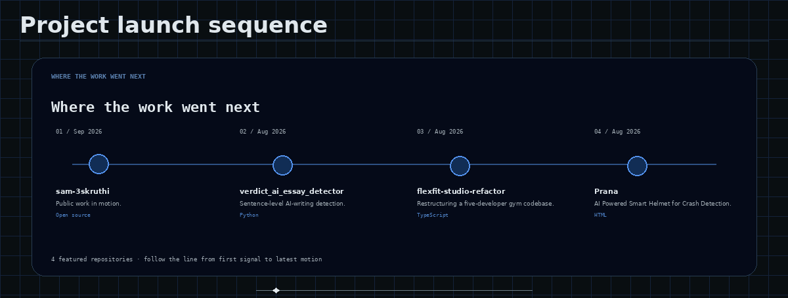
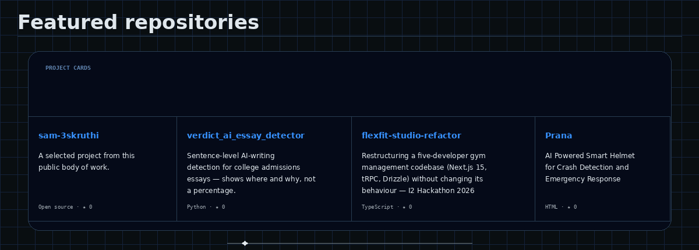
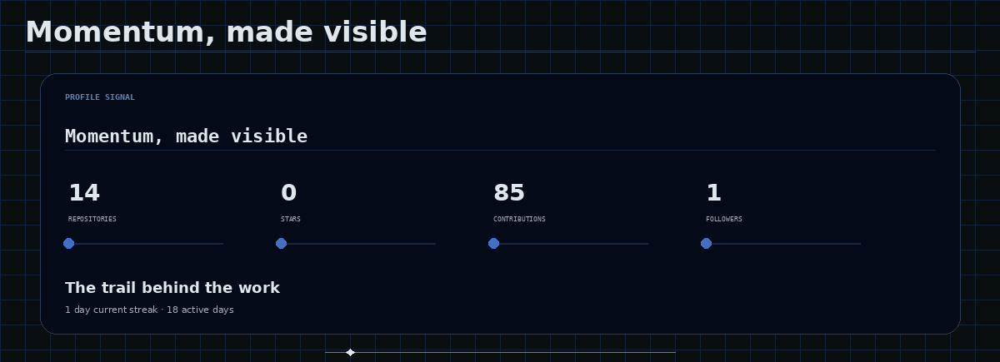
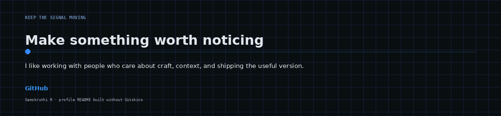

# Samskruthi R

  

  <b>Frontend or full-stack engineer</b> · the public internet

  Aspiring ML student building intelligent solutions for real-world problems. 
  Learning end-to-end ML — data to deployment.

  <a href="https://github.com/sam-3skruthi">GitHub</a>

✦━━━━━━━━━━━━━━━━━━━━✦

  

✦━━━━━━━━━━━━━━━━━━━━✦

  

✦━━━━━━━━━━━━━━━━━━━━✦

  

✦━━━━━━━━━━━━━━━━━━━━✦

  

  

  

✦━━━━━━━━━━━━━━━━━━━━✦

  

  

